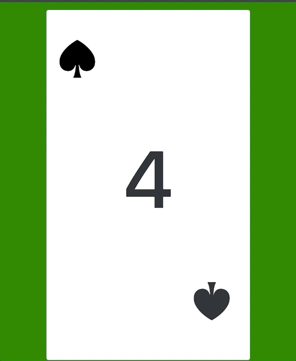

# Random Card Generator

A simple random card generator that uses a vanilla-js boilerplate, bootstrap, HTML, and CSS. Upon refreshing the page randomly shows a different card among those in a standard 52 card deck.



## Live App: [https://scotth527.github.io/randomcard/](https://scotth527.github.io/randomcard/)

## Built from the 4GeeksAcademy vanilla-js boilerplate here: [https://github.com/4GeeksAcademy/react-hello](https://github.com/4GeeksAcademy/react-hello)


# Hello World with Vanilla JS

> Requirements: Make sure you have node version 8

#### install the breathecode cli (command-line-interface)
```sh
npm i breathecode-cli -g
```

##### Download the boilerplate using the BreatheCode CLI
```
$ bc start:vanillajs-project -r
```
##### and install the npm package:
```
$ npm install
```